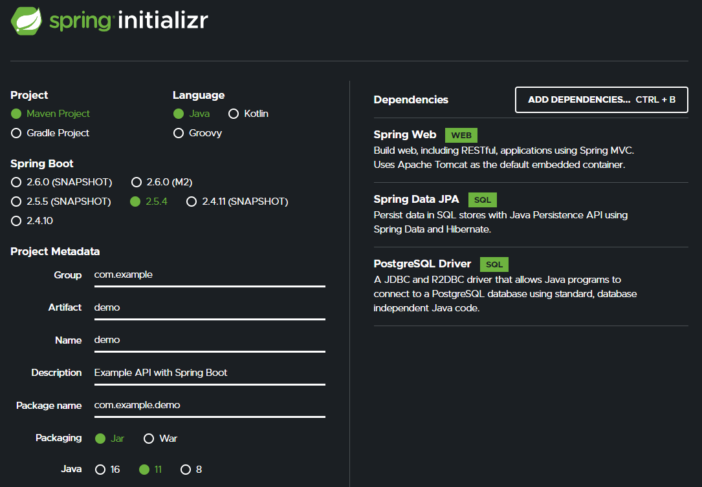

# Spring Boot Example API
In this project, I created a simple RESTful API using [Spring Boot](https://spring.io/projects/spring-boot). Limited data on the wealthiest billionaires (sourced from the [Forbes Billionaires List](https://www.forbes.com/billionaires/)) is stored in a PostgreSQL database when first running the service. The service allows for `GET`, `POST`, `PUT`, and `DELETE` functionality to interact with the existing data or add new data. All data is cleared when ending the service, allowing for a reset to the default data upon restart.

# Walkthrough
## Running the Service
A PostgreSQL database is utilized in this project and is required in order for the service to properly run. For those who need to install PostgreSQL, I recommend visiting the [EDB PostgreSQL Database Download page](https://www.enterprisedb.com/downloads/postgres-postgresql-downloads?quicktabs_postgres_plus_dwnlds=6) for more information. The connection information can be modified according to your needs by changing the `application.properties` file under `src/main/resources`. 

```java
spring.datasource.url=jdbc:postgresql://localhost:5432/billionaire
spring.datasource.username=postgres
spring.datasource.password=qwerty123
spring.jpa.hibernate.ddl-auto=create-drop
spring.jpa.show-sql=true
spring.jpa.properties.hibernate.dialect=org.hibernate.dialect.PostgreSQLDialect
spring.jpa.properties.hibernate.format_sql=true
```

Once the database connection is properly established, running the `DemoApplication.java` file under `src/main/java/com/example/demo` will start the service.

## Spring Initializr
The initial files for the project were gathered using [Spring Initializr](https://start.spring.io/). The specific settings and dependencies used can be seen below. Clicking [this link](https://start.spring.io/#!type=maven-project&language=java&platformVersion=2.5.4&packaging=jar&jvmVersion=11&groupId=com.example&artifactId=demo&name=demo&description=Example%20API%20with%20Spring%20Boot&packageName=com.example.demo&dependencies=web,data-jpa,postgresql) will take you to the same page with everything prefilled. 



## Billionaire Class
The `Billionaire` class includes five attributes:
- `id` - a unique identifier
- `name`
- `netWorth` - in billions of dollars
- `age`
- `country`

## Controller Class
The `BillionareController` class contains the logic for how to handle various requests. For example, sending a `POST` request will call upon the `addNewBillionaire` method in the `BillionareService` class in order to update the database with the information provided, as shown below:

```java
@PostMapping
public void addBillionaire(@RequestBody Billionaire billionaire) {
    billionaireService.addNewBillionaire(billionaire);
}
```

## Service Class
The `BillionaireService` class contains the logic for how to implement requests received by the controller class. The following example shows what occurs when a `DELETE` request is received. As long as the `id` attribute supplied in the request exists in the database, the associated billionaire is deleted (otherwise, an exception is thrown).

```java
public void deleteBillionaire(Long billionaireId) {
    boolean exists = billionaireRepository.existsById(billionaireId);
    if (!exists) {
        throw new IllegalStateException(
                "Billionaire with ID " + billionaireId + " does not exist");
    }
    billionaireRepository.deleteById(billionaireId);
}
```

## Functionality
### `GET`
To retrieve a list of the available billionaires in the database simply visit the `localhost:8080/api/v1/billionaires` path after running the service. The following data will be displayed by default:

```json
[
  {
    "id": 1,
    "name": "Jeff Bezos",
    "netWorth": 177,
    "age": 57,
    "country": "United States"
  },
  {
    "id": 2,
    "name": "Elon Musk",
    "netWorth": 151,
    "age": 49,
    "country": "United States"
  }
]
```

### `POST`
To add a new billionaire to the list, simply send a `POST` request with the relevant data. The `id` attribute increments automatically and does not need to be supplied while the other attributes are all optional. 

Example:
```bash
$ curl -X POST http://localhost:8080/api/v1/billionaires -H "Content-Type:application/json" -d "{\"name\": \"Bernard Arnault\", \"netWorth\": 150}"
```

### `PUT`
Updating information in the database is as simple as sending a `PUT` request to the API path appended by the `id` number and attributes of the billionaire to modify in the format of `<id>?<attr>=<value>`.

Example:
```bash
$ curl -X PUT http://localhost:8080/api/v1/billionaires/1?age=100
```

### `DELETE`
Appending the `id` number of a billionaire to the API path will delete that record from the database provided the `id` currently exists.

Example:
```bash
$ curl -X DELETE http://localhost:8080/api/v1/billionaires/1
```

# Potential Improvements
There are many ways in which this project could be improved, including:
- Reducing boilerplate code by using libraries such as [`lombok`](https://projectlombok.org/)
- Building a basic front-end for easier and faster data manipulation
- Incorporating better error handling, especially for `POST` and `PUT` requests which currently do not check for duplicate values (i.e., the same record could be entered twice)

# Acknowledgements
Resources that helped immensely with the completion of this project:
- [Baeldung](https://www.baeldung.com/spring-boot)
- [Spring Guides](https://spring.io/guides)
- Nelson of [Amigoscode](https://www.youtube.com/channel/UC2KfmYEM4KCuA1ZurravgYw)